data engineer @ CH Media. previously worked on applied NLP research and telecom analytics. interested in software that ships and scales.

a recent walk, schynige platte → first over the faulhorn. the 3d version is on <a href="https://nle.sh">nle.sh</a>
